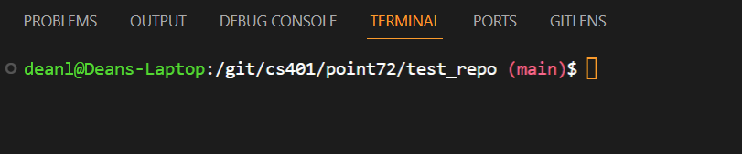
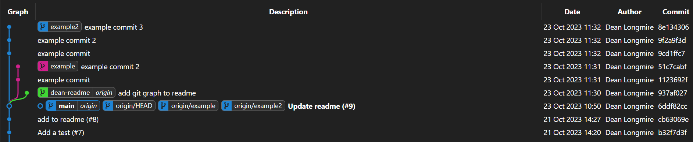

# test_repo
## Git Branches
I use this to show me what branch I am on when in a git repository.



To replicate this, add this code to your `~/.bashrc` file:
```sh
function parse_git_branch () {
  git branch 2> /dev/null | sed -e '/^[^*]/d' -e 's/* \(.*\)/ (\1)/'
}
YELLOW="\[\033[0;33m\]"
GREEN="\[\033[0;32m\]"
BLUE="\[\033[0;31m\]"
NO_COLOR="\[\033[0m\]"
PS1="$GREEN\u@\h$NO_COLOR:\w$BLUE\$(parse_git_branch)$NO_COLOR\$ "
```
Easily open bashrc using `vim ~/.bashrc`.

There are other ways to get a similar effect but this way is pretty straightforward and works with bash shell.

I also really like git graph visualizers as they help explain how the repo looks. The one I use the most is [here](https://marketplace.visualstudio.com/items?itemName=mhutchie.git-graph).



## Aliases
The `/aliases` folder has some useful git and rust aliases that I use that I think everyone might find helpful.

To use these copy the file or specific alias you want. Paste the file somewhere such as your home directory, or if you already have an alias file, paste the function in there. 

Add this to your `~/.bashrc` file:
```sh
source /path/to/your/alias/file
```

You can either restart your console or run `source ~/.bashrc` to have the aliases work.

## Technologies

### Web3 API

```toml
web3 = "0.15"
```

- Handle Ethereum event data

### Soloana API

```toml
solana-client = "1.10"
solana-sdk = "1.10"
```

- Handle Soloana event data

### Tokio

```toml
tokio = { version = "1", features = ["full"] }
```

### Serde

```toml
serde = { version = "1.0", features = ["derive"] }
```

### Serde JSON

```toml
serde_json = "1.0"
```

### AWS SDK Rust

```toml
aws-sdk-rust = "0.1"
```

- Possible library used to interact with AWS S3 if we choose to go that route

## Project Structure

### Roles

- Everyone should try and have some small role in the backend, whether it be data manipulation and translation, API to the blockchain, API to the database, DBA, or even just Cargo structuring
- I am sure more roles will become apparent to us as we start development but this isn't a bad place to start

#### Connor

- Front-end visualization

Pick one or some of:

- DB APIs
- DBA

#### Dean

- Github Manager - code review, branch settings, merging pull requests, repo creation
- Cargo Project Structuring - creating consistent directory design

Pick one or some of:

- Blockchain APIs
- Data manipulation
- DB APIs
- DBA

#### Harry

- Point-72 communicator

Pick one or some of:
- Blockchain APIs
- Data manipulation
- DB APIs
- DBA

#### Jiawei

- Documentation

Pick one or some of:
- Blockchain APIs
- Data manipulation
- DB APIs
- DBA

#### Logan

- Documentation

Pick one or some of:
- Blockchain APIs
- Data manipulation
- DB APIs
- DBA

#### Ryan

- Front-end visualization

Pick one or some of:
- Blockchain APIs
- Data manipulation
- DB APIs
- DBA